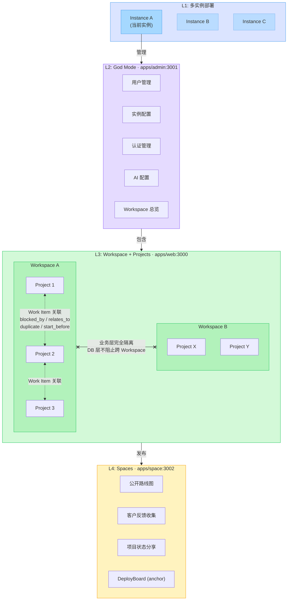
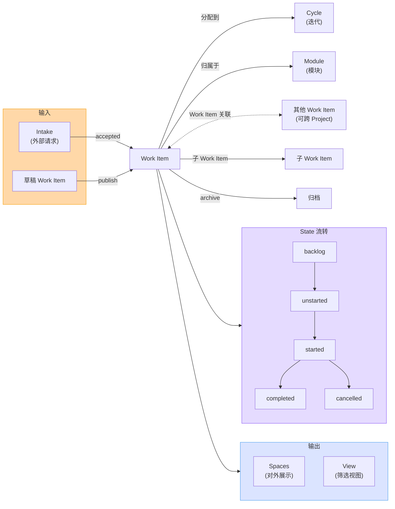

# Plane 应用分层概览

> Excalidraw 图（合并版）: https://excalidraw.com/#json=R5dK8wQdYDDryy3r5KPXq,JSbFMSFEOiKow3k-N-hBTA

## 各层说明

### L1: 多实例部署

Plane 支持独立部署多个实例，每个实例拥有独立的数据库、配置和用户体系。对应模型: `Instance`, `InstanceAdmin`, `InstanceConfiguration`。

### L2: God Mode (实例管理)

单实例级别的管理面板 (`apps/admin`, port 3001)，负责:

- **用户管理**: 实例管理员
- **实例配置**: 名称、域名、遥测
- **认证管理**: OAuth (GitHub, GitLab, Google, Gitea)、密码策略
- **AI 配置**: OpenAI 等 LLM 设置
- **Workspace 总览**: 查看和管理实例内所有 Workspace，控制 `DISABLE_WORKSPACE_CREATION` 等开关

### L3: Workspace + Projects (核心工作层)

主应用 (`apps/web`, port 3000) 的核心组织结构。

#### L3 Excalidraw 图

- 实体层级图: https://excalidraw.com/#json=sEYQ8moi67o-RQpKZ2BmT,uIO4ImiiOkdb0CV2yUSLjg
- Work Item 工作流图: https://excalidraw.com/#json=MAiLKVmWV0qbYARhPxIbE,AC0w-5rBknEgZglw-8q2eg

#### L3 实体层级图

```mermaid
graph TD
    subgraph WS["Workspace"]
        direction TB
        WM["WorkspaceMember<br/>(admin/member/guest)"]
        TM["Team (Pro, CE 不支持)"]
        LB_W["Label (workspace 级)"]
        PG["Page<br/>(协作文档, 可关联多个 Project)"]
        SK["Sticky (个人便签)"]
        IV_W["View (workspace 级)"]
        WH["Webhook<br/>(事件推送, HMAC 签名)"]

        subgraph PROJ["Project"]
            direction TB
            PM["ProjectMember"]
            ST["State<br/>(backlog → unstarted →<br/>started → completed → cancelled)"]
            ES["Estimate → EstimatePoint"]
            LB_P["Label (project 级)"]
            IV_P["View (project 级)"]

            subgraph CONTAINERS["工作容器"]
                CY["Cycle (迭代)"]
                MO["Module (模块)"]
                IN["Intake (收件箱)"]
            end

            subgraph ISSUE["Work Item (后端模型: Issue)"]
                direction TB
                I_CORE["priority / state / assignees<br/>labels / estimate_point<br/>start_date / target_date"]
                I_SUB["子 Work Item (parent 自引用)<br/>⚠️ 业务层限制同 Project"]
                I_CMT["评论 → 表态"]
                I_ACT["变更日志 (审计)"]
                I_ATT["附件 / 链接"]
                I_REA["表态 / 投票"]
                I_REL["Work Item 关联<br/>(blocked_by / relates_to / duplicate<br/>start_before / finish_before / implemented_by)"]
                I_VER["快照历史"]
            end

            DI["草稿 Work Item"]
        end
    end

    CY ---|"CycleIssue (N:N)"| ISSUE
    MO ---|"ModuleIssue (N:N)"| ISSUE
    IN ---|"IntakeIssue<br/>(pending → accepted/rejected)"| ISSUE
    I_SUB -.->|"parent 自引用<br/>业务层限制同 Project<br/>DB 层不阻止跨 Workspace"| ISSUE
    I_REL -.->|"跨 Project 关联<br/>(同 Workspace 内, UI 有 Workspace Level 开关)<br/>DB 层不阻止跨 Workspace"| ISSUE
    PG ---|"ProjectPage (N:N)"| PROJ

    style WS fill:#d3f9d8,stroke:#22c55e
    style PROJ fill:#b2f2bb,stroke:#22c55e
    style CONTAINERS fill:#a5d8ff,stroke:#4a9eed
    style ISSUE fill:#fff3bf,stroke:#f59e0b
```

#### L3 Work Item 工作流图

#### L3 详细说明

- **Workspace** 是顶层实体，包含成员、团队、项目
- **Project** 属于 Workspace，包含 Work Items、Cycles、Modules、Pages、Views
- **三大工作容器**:
  - **Cycle** (迭代/Sprint): 时间盒，Work Item 通过 CycleIssue 多对多关联
  - **Module** (模块/Feature): 功能分组，Work Item 通过 ModuleIssue 多对多关联
  - **Intake** (收件箱): 外部请求入口，状态流: pending → accepted/rejected/snoozed/duplicate
- **Page**: Workspace 级协作文档，可通过 ProjectPage 关联多个 Project，支持嵌套和版本历史
- **关联范围与扩展性**:
  | 关联方式 | DB 模型约束 | 业务层限制 | 前端 UI 范围 |
  |----------|------------|-----------|-------------|
  | 父子 Work Item | `ForeignKey("self")` 无 project/workspace 约束 | Serializer 校验同 Project | 仅当前 Project |
  | Work Item 关联 | `ForeignKey(Issue)` × 2，无 workspace 约束 | 无显式 workspace 校验 | Workspace Level 开关（同 Workspace 跨 Project） |
  | 跨 Workspace | DB 层完全不阻止 | 无实现 | 无 UI 入口 |
- **Work Item 关联类型** (6 种):
  | 正向 | 反向 | 对称 |
  |------|------|------|
  | `blocked_by` | `blocking` | 否 |
  | `relates_to` | `relates_to` | 是 |
  | `duplicate` | `duplicate` | 是 |
  | `start_before` | `start_after` | 否 |
  | `finish_before` | `finish_after` | 否 |
  | `implemented_by` | `implements` | 否 |
- **跨 Project 关联入口**: Work Item 详情页 → Add Relation → Workspace Level 开关，后端 `workspace_search` 参数
- **跨 Workspace 扩展可能性**: DB 模型不阻止，扩展只需放宽 Serializer 校验 + 前端搜索范围 + 跨 Workspace 权限校验
  - 代码注释 `# Check parent issue is from workspace as it can be cross workspace` (`issue.py:177`) 表明开发者已意识到此可能性
- 跨团队需求依赖在此层解决（多团队需在同一 Workspace 内，用不同 Project 组织）
- **审计体系**: 变更日志 (IssueActivity) + 快照历史 (IssueVersion) + 文档快照 (PageVersion)
- **术语说明**: 前端统一使用 **Work Item**，后端模型历史原因仍为 `Issue`，API 变量已逐步迁移为 `work_item`

### L4: Spaces (只读对外展示)

公开项目分享 (`apps/space`, port 3002):

- 通过 `DeployBoard` 模型生成 `anchor` 公开链接
- 支持实体类型: project, work item, module, cycle, page, view, intake
- 可选功能: 评论、反应、投票、活动流
- 典型用途: 公开路线图、客户反馈收集、项目状态分享
- **注意**: 只读展示，不支持跨项目依赖管理
